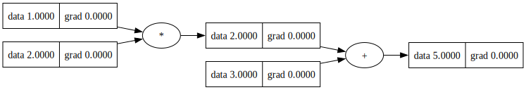
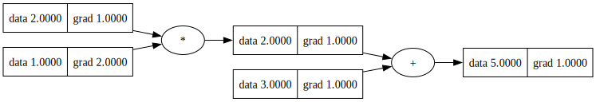
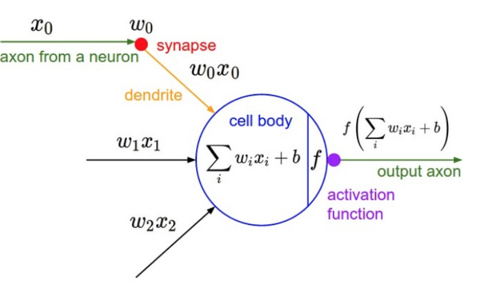
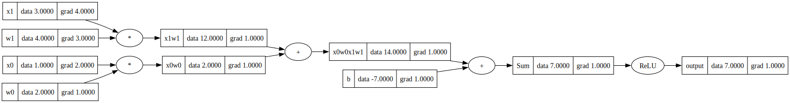
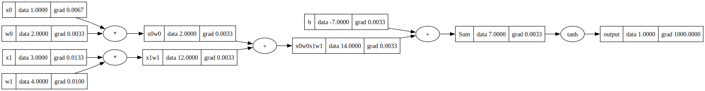
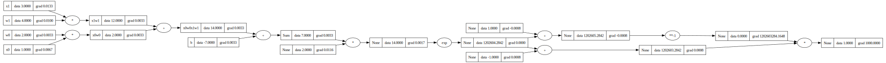

这个想法其实很早就有了，但一直因为毕业设计和比赛没能真正开始。最近系统看完了 Andrej Karpathy 本讲的公开课程和仓库资料，收获很大，于是决定亲手复现一版。本篇文章会记录我从零实现这个项目的思路与过程（[项目地址](https://github.com/AAAAAZBX/myTorch)）。

## 项目介绍

myTorch 是一个模仿 PyTorch 实现的深度学习库，主要用于实现autograd engine (自动梯度引擎)，用来实现**反向传播**。

为了更贴近 PyTorch 的效果，本项目在原项目 micrograd 构建方式上有所区别。

反向传播（英语：Backpropagation，意为误差反向传播，缩写为BP）是对多层人工神经网络进行梯度下降的算法，也就是用链式法则以网络每层的权重为变量计算损失函数的梯度，以更新权重来最小化损失函数。

## 构建 myTorch 数据结构

### 定义数据结构 Tensor

这里先实现最小版本的 `Tensor`，只保存标量数值并支持基础运算。

```python
class Tensor:
    def __init__(self, data):
        self.data = data

    def __repr__(self):
        return f"Tensor(data={self.data})"

    def __add__(self, other):
        out = Tensor(self.data + other.data)
        return out

    def __mul__(self, other):
        out = Tensor(self.data * other.data)
        return out

a = Tensor(1.0)
b = Tensor(2.0)
c = Tensor(3.0)

d = a * b + c # (a.__mul__(b)).__add__(c)

print(d) # Tensor(data=5.0)
```

现在在这个表达式的基础上添加联系组织，用于保留有关哪些值产生了哪些其他值的指针。

```python
class Tensor:
    def __init__(self, data, _children=(), _op=''):
        self.data = data
        self.prev = set(_children)
        self._op = _op

    def __repr__(self):
        return f"Tensor(data={self.data})"

    def __add__(self, other):
        out = Tensor(self.data + other.data, (self, other), '+')
        return out

    def __mul__(self, other):
        out = Tensor(self.data * other.data, (self, other), '*')
        return out
```

这样便可以知道每个值的子项，并且能够追溯到是哪个运算操作生成了这个值。

这一步我当时踩过一个命名坑：`prev` 和 `_prev` 混用会导致后面的 `trace()` 直接报错，建议从这里开始统一字段名。

为了更加直观地可视化整个计算图，要在类中加入 label 来标识各个变量名，使用下面的代码.(具体实现方式可以不必深究，知道其能够显示计算图的拓扑顺序即可)

```python
def trace(root):
    nodes, edges = set(), set()
    def build(v):
        if v not in nodes:
            nodes.add(v)
            for child in v._prev:
                edges.add((child, v))
                build(child)
    build(root)
    return nodes, edges

def draw_dot(root, format='svg', rankdir='LR'):
    """
    format: png | svg | ...
    rankdir: TB (top to bottom graph) | LR (left to right)
    """
    assert rankdir in ['LR', 'TB']
    nodes, edges = trace(root)
    dot = Digraph(format=format, graph_attr={'rankdir': rankdir}) #, node_attr={'rankdir': 'TB'})
    
    for n in nodes:
        dot.node(name=str(id(n)), label = "{ data %.4f | grad %.4f }" % (n.data, n.grad), shape='record')
        if n._op:
            dot.node(name=str(id(n)) + n._op, label=n._op)
            dot.edge(str(id(n)) + n._op, str(id(n)))
    
    for n1, n2 in edges:
        dot.edge(str(id(n1)), str(id(n2)) + n2._op)
    
    return dot
```

调用下面的方法便可以得到整张计算图之间各个变量，以及运算符之间的联系

```python
a = Tensor(1.0, label='a')
b = Tensor(2.0, label='b')
c = Tensor(3.0, label='c')
e = a * b
e.label = 'e'
d = e + c
d.label = 'd'

print(d) # Tensor(data=5.0)
dot = draw_dot(d)
dot.render("tensor_graph", view=True)
```

运行结果:



## 反向传播

### 链式法则

根据上面的式子 $d = a \times b + c$，可以用偏导来衡量每个输入变量对输出 $d$ 的影响：

$$
\frac{\partial d}{\partial a} = b,\quad
\frac{\partial d}{\partial b} = a,\quad
\frac{\partial d}{\partial c} = 1
$$

这三个结果的含义分别是：
- $\frac{\partial d}{\partial a}=b$：当 $a$ 增大一点点时，$d$ 的变化率由当前的 $b$ 决定。
- $\frac{\partial d}{\partial b}=a$：当 $b$ 增大一点点时，$d$ 的变化率由当前的 $a$ 决定。
- $\frac{\partial d}{\partial c}=1$：$c$ 与 $d$ 是线性相加关系，$c$ 增加多少，$d$ 就增加多少。

为了更直观的理解偏导的意义，可以从以下几个例子来解释：

```python
def diff_on_a():
    h = 0.0001

    a = Tensor(1.0, label='a')
    b = Tensor(2.0, label='b')
    c = Tensor(3.0, label='c')
    e = a * b
    e.label = 'e'
    d1 = e + c
    d1.label = 'd1'

    a = Tensor(1.0 + h, label='a')
    b = Tensor(2.0, label='b')
    c = Tensor(3.0, label='c')
    e = a * b
    e.label = 'e'
    d2 = e + c
    d2.label = 'd2'

    print((d2.data - d1.data) / h)  # 约等于 2.0（即当前 b 的值）


def diff_on_b():
    h = 0.0001

    a = Tensor(1.0, label='a')
    b = Tensor(2.0, label='b')
    c = Tensor(3.0, label='c')
    d1 = a * b + c

    a = Tensor(1.0, label='a')
    b = Tensor(2.0 + h, label='b')
    c = Tensor(3.0, label='c')
    d2 = a * b + c

    print((d2.data - d1.data) / h)  # 约等于 1.0（即当前 a 的值）


def diff_on_c():
    h = 0.0001

    a = Tensor(1.0, label='a')
    b = Tensor(2.0, label='b')
    c = Tensor(3.0, label='c')
    d1 = a * b + c

    a = Tensor(1.0, label='a')
    b = Tensor(2.0, label='b')
    c = Tensor(3.0 + h, label='c')
    d2 = a * b + c

    print((d2.data - d1.data) / h)  # 约等于 1.0
```

上面三个函数分别对应对 $a$、$b$、$c$ 做微小扰动：
- 对 $a$ 扰动时，变化率约等于 $b$；
- 对 $b$ 扰动时，变化率约等于 $a$；
- 对 $c$ 扰动时，变化率恒为 $1$。


这些结果说明了一个事实：每个局部变化率都可以通过链式法则一路传递到最终输出，这正是反向传播的本质。  
接下来将不再用数值扰动估计梯度，而是基于计算图实现自动反向传播。

### 链式法则到反向传播

对于复合表达式，梯度可以写成局部导数的连乘：

$$
\frac{\partial L}{\partial x}
=
\frac{\partial L}{\partial u}
\cdot
\frac{\partial u}{\partial x}
$$

在计算图中，我们从最终输出节点出发，按拓扑逆序依次回传每个节点的梯度，并把梯度累加到其父节点上。

### 反向传播代码实现

```python
class Tensor:
    def __init__(self, data, _children=(), _op='', label=None):
        self.data = data
        self.grad = 0.0
        self._prev = set(_children)
        self._op = _op
        self.label = label
        self._backward = lambda: None

    def __repr__(self):
        return f"Tensor(data={self.data})"

    def __add__(self, other):
        out = Tensor(self.data + other.data, (self, other), '+')
        def _backward():
            # z = x + y, dz/dx = 1, dz/dy = 1
            # 把 out 的梯度原样分配给两个输入节点
            self.grad += out.grad
            other.grad += out.grad
        out._backward = _backward
        return out

    def __mul__(self, other):
        out = Tensor(self.data * other.data, (self, other), '*')
        def _backward():
            # z = x * y, dz/dx = y, dz/dy = x
            # 按链式法则乘以上游梯度 out.grad
            self.grad += other.data * out.grad
            other.grad += self.data * out.grad
        out._backward = _backward
        return out

    # backward 核心流程：
    # 1) 从当前输出节点出发构建拓扑序
    # 2) 将输出节点梯度设为 1.0（即 dd/dd = 1）
    # 3) 按拓扑逆序调用每个节点的局部 _backward，实现链式法则回传
    def backward(self):
        topo = []
        visited = set()
        def build_topo(v):
            if v not in visited:
                visited.add(v)
                for child in v._prev:
                    build_topo(child)
                topo.append(v)
        build_topo(self)
        self.grad = 1.0
        for v in reversed(topo):
            v._backward()
```

`backward()` 里最容易漏的是 `topo.append(v)` 这行，少了它就会出现“反传执行了但梯度不更新”的假象。

```python
dot = draw_dot(d)
dot.render("tensor_graph", view=True)
```



有了加法和乘法的反向传播代码,再加上激活函数（激活函数先使用最简单的ReLU），就可以据此实现一个简单的神经元



```python
x0 = Tensor(1.0, label='x0')
w0 = Tensor(-2.0, label='w0')
x1 = Tensor(-3.0, label='x1')
w1 = Tensor(4.0, label='w1')
b = Tensor(7.0, label='b')
x0w0 = x0 * w0; x0w0.label = 'x0w0'
x1w1 = x1 * w1; x1w1.label = 'x1w1'
x0w0x1w1 = x0w0 + x1w1; x0w0x1w1.label = 'x0w0x1w1'
Sum = x0w0x1w1 + b; Sum.label = 'Sum'
output = Sum.relu(); output.label = 'output'
output.backward()

dot = draw_dot(output)
dot.render("neural_graph", view=True)
```

得到的计算图如下：



## 以tanh为例子验证代码正确性

下面把 ReLU 替换为 tanh 激活函数，采用两种方式实现来验证反向传播正确性

### 直接调用tanh函数

tanh 的原函数表达式为：

$$
\tanh(x)=\frac{e^x-e^{-x}}{e^x+e^{-x}}
$$

tanh 的导函数为：

$$
\frac{d}{dx}\tanh(x)=1-\tanh^2(x)
$$

代码如下：

```python
def tanh(self):
    out = Tensor(np.tanh(self.data), (self,), 'tanh')
    def _backward():
        self.grad += (1 - np.tanh(self.data) ** 2) * out.grad
    out._backward = _backward
    return out
```

主函数调用和最终运行结果如下(这里为了让结果显示的更加精确一点，backward 里面的最终结果的初始 grad 设置为了 1000.0)：

```python
x0 = Tensor(1.0, label='x0')
w0 = Tensor(2.0, label='w0')
x1 = Tensor(3.0, label='x1')
w1 = Tensor(4.0, label='w1')
b = Tensor(-7.0, label='b')
x0w0 = x0 * w0; x0w0.label = 'x0w0'
x1w1 = x1 * w1; x1w1.label = 'x1w1'
x0w0x1w1 = x0w0 + x1w1; x0w0x1w1.label = 'x0w0x1w1'
Sum = x0w0x1w1 + b; Sum.label = 'Sum'
output = Sum.tanh(); output.label = 'output'
output.backward()

dot = draw_dot(output)
dot.render("./bp_result/tanh1", view=True)
```



### 将 tanh 按公式拆分后调用

```python
x0 = Tensor(1.0, label='x0')
w0 = Tensor(2.0, label='w0')
x1 = Tensor(3.0, label='x1')
w1 = Tensor(4.0, label='w1')
b = Tensor(-7.0, label='b')
x0w0 = x0 * w0; x0w0.label = 'x0w0'
x1w1 = x1 * w1; x1w1.label = 'x1w1'
x0w0x1w1 = x0w0 + x1w1; x0w0x1w1.label = 'x0w0x1w1'
Sum = x0w0x1w1 + b; Sum.label = 'Sum'
o = 2 * Sum
exp = o.exp()
output = (exp - 1) / (exp + 1)
output.backward()

dot = draw_dot(output)
dot.render("./bp_result/tanh2", view=True)
```

在运行这段拆分代码之前，需要先为 `Tensor` 补充减法、除法等运算符重载，保证表达式能够完整执行，具体可以参考代码实现。

这里需要注意，除法依赖幂运算（例如 `x / y -> x * y**-1`），所以要同时补上 `__pow__` 才能完整跑通。



对比两种实现的运行结果可以发现：将 `tanh` 按表达式拆分后，最终的梯度回传结果保持一致，说明反向传播链路是正确的。

另外如果图里看到很多 `0.0000`，有时候只是梯度很小再加上显示精度不够，我在这里的解决方式比较简单粗暴，将初始梯度从1增加到了1000。

## 附录:

https://github.com/karpathy/micrograd

[Youtube课程原视频](https://www.youtube.com/watch?v=VMj-3S1tku0&list=PLAqhIrjkxbuWI23v9cThsA9GvCAUhRvKZ)

[b站翻译版本](https://www.bilibili.com/video/BV1mqrTBvEaf/?spm_id_from=333.1007.top_right_bar_window_custom_collection.content.click&vd_source=758fb7e86b317eb62ce96b2962bc1d3a)

https://zhuanlan.zhihu.com/p/30640636947